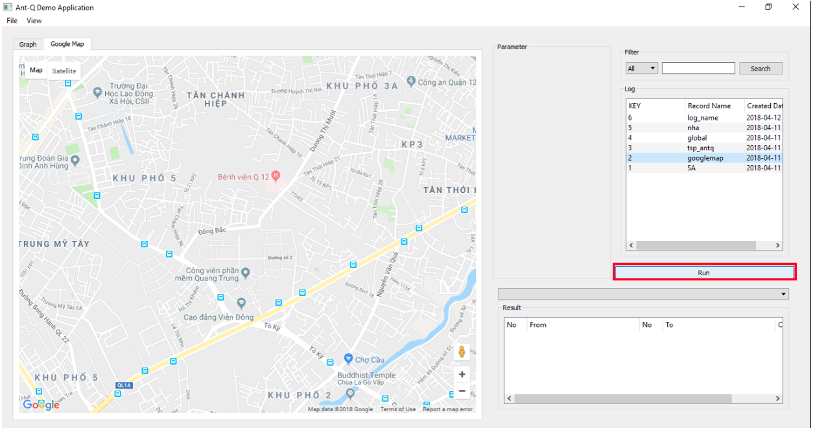
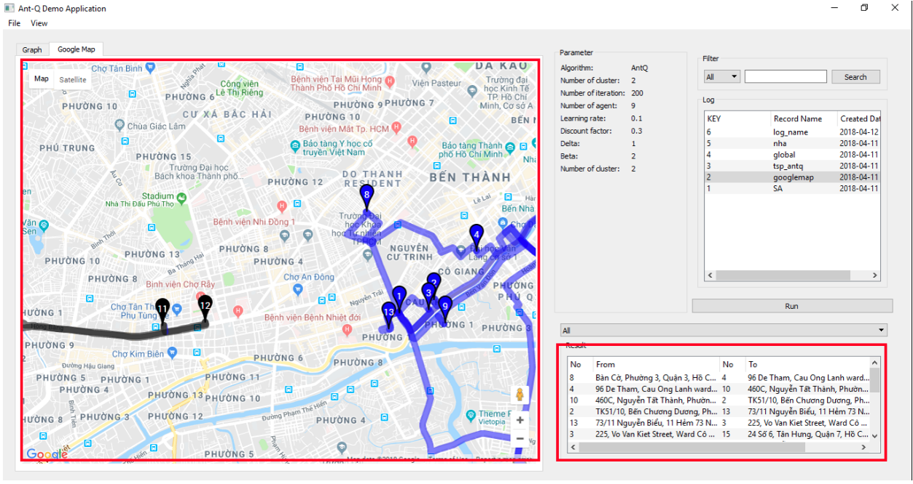
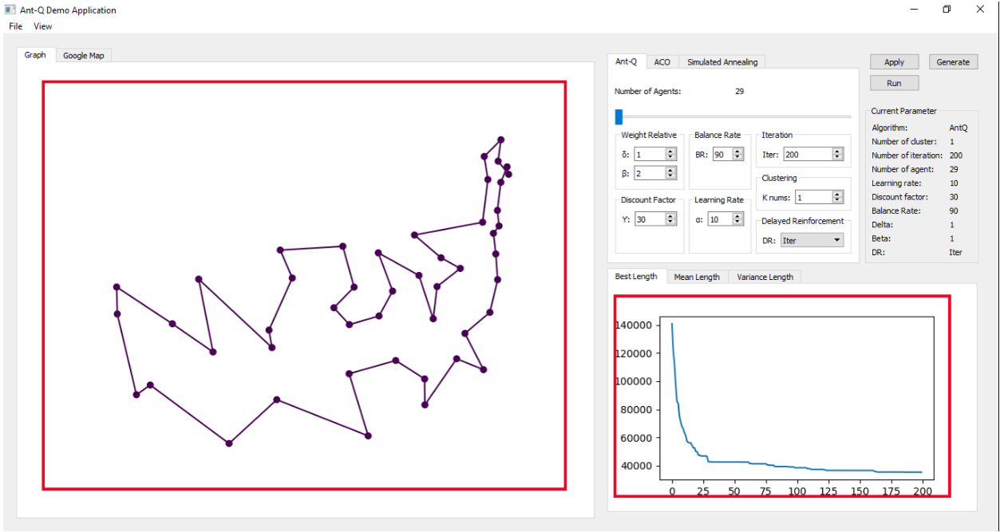

# Reinforcement Learning in TSP

## Problem Abstract
During researching, we applied Ant-Q algorithm which will be the main algorithm to solve the delivery problem. However, in order to fit the situation where many delivery men would be involved in one delivery session as well as to improve the algorithm performance-wise, clustering and to be specific, K-means++ will be used to divide and conquer  big delivery problems.

## Used Algorithms
1. Ant Colony System
2. Simulated Annealing
3. Ant-Q
4. Kmeans++

## Users Scope
### Algorithms
- Adjust parameters
- Select algorithms
- Load model of environment
- Run selected algorithm
- View real-time graph/chart
- Save solutions as logs
### Map Manager
- Search saved solutions
- Apply road map to saved solutions
- Apply road map to each clusters
### Log Manager
- Compare selected logs
- View statistic details

## Demo UI

